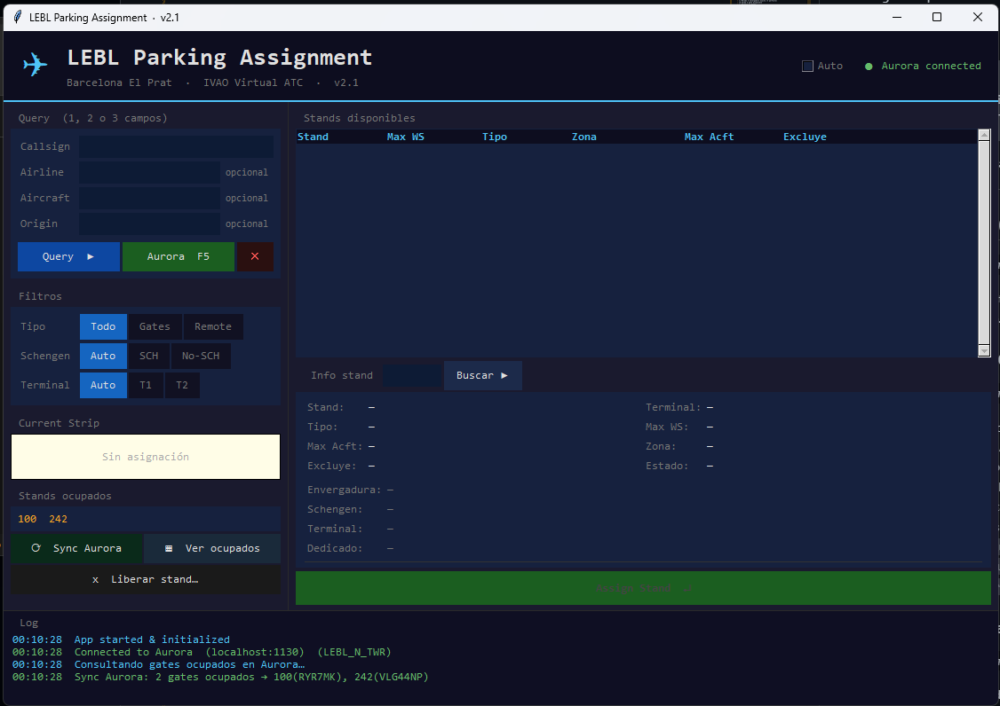
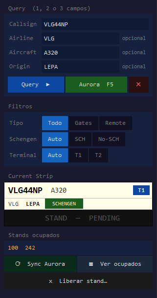
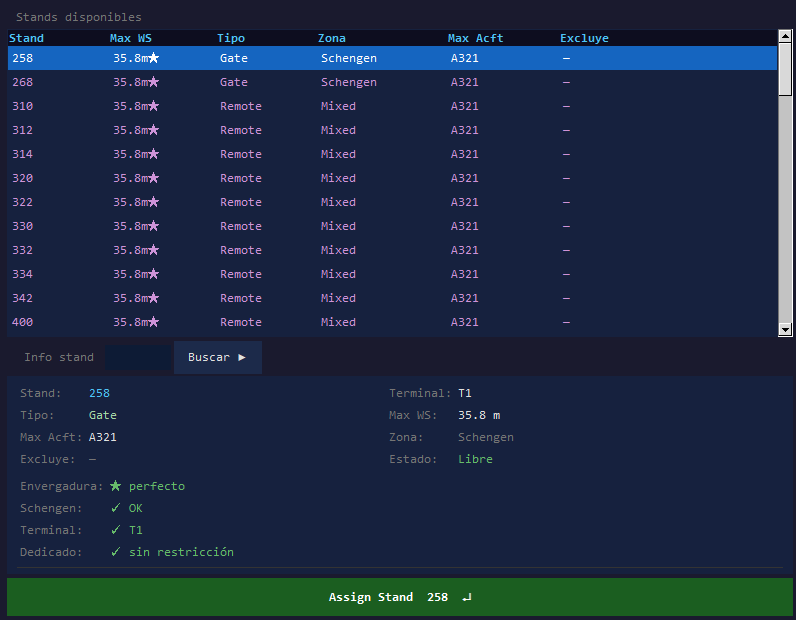
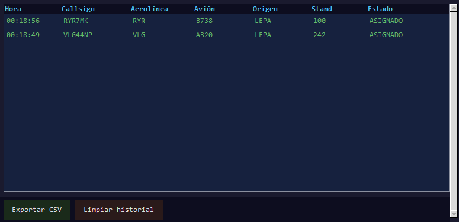
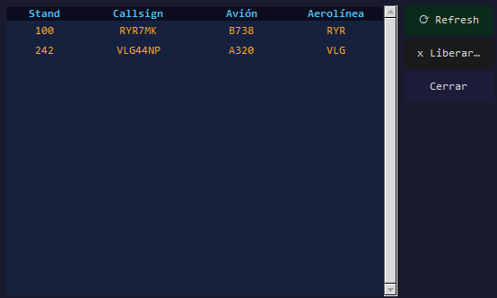
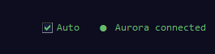

# LEBL Parking Assignment System
Sistema de asignación de parkings para el aeropuerto de Barcelona El Prat (LEBL) en IVAO Virtual ATC.

---

## Instalación rápida

### Opción A — Ejecutable (recomendada, sin Python)
Descarga `LEBL Parking.exe` de la sección [Releases](../../releases) y ejecútalo directamente. No requiere Python ni ninguna dependencia.

### Opción B — Desde fuente (Python 3.8+)
```
git clone ...
python parking_gui.py        # GUI
python parking_finder.py     # CLI
```
Sin dependencias externas — solo librería estándar de Python.

---

## Interfaz gráfica (GUI)

<!-- SCREENSHOT: vista general de la aplicación -->


La GUI permite asignar stands, consultar información, sincronizar con Aurora y gestionar todos los stands asignados en una sesión.

### Panel izquierdo — Query y ocupados

<!-- SCREENSHOT: panel izquierdo con campos de query y filtros -->


- **Query** — introduce 1, 2 o 3 campos (Callsign, Airline, Aircraft, Origin). Con solo Aircraft busca por envergadura; con Airline calcula terminal y dedicados automáticamente.
- **Filtros** — Tipo (Todo / Gates / Remote), Schengen (Auto / SCH / No-SCH), Terminal (Auto / T1 / T2). Se combinan con la query.
- **Current Strip** — tarjeta de vuelo con callsign, avión, terminal, zona Schengen y stand asignado.
- **Stands ocupados** — lista de todos los stands bloqueados en la sesión actual.
  - `⟳ Sync Aurora` — importa los stands ocupados en tiempo real desde Aurora.
  - `▦ Ver ocupados` — abre el panel de ocupados con callsign y avión por stand.
  - `x Liberar stand…` — libera un stand manualmente.

### Panel derecho — Tabla de stands y detalles

<!-- SCREENSHOT: tabla de stands disponibles -->


- **Tabla de stands disponibles** — columnas Stand, Max WS, Tipo, Zona, Max Acft, Excluye. Colores:
  - 🟣 Morado — envergadura exacta (★ perfecto)
  - 🟢 Verde — gate disponible
  - 🟠 Naranja — remoto
  - 🟡 Amarillo — fallback (otro terminal)
- **Info stand** — búsqueda directa por ID con todos los datos del stand + checks de compatibilidad (envergadura, Schengen, terminal, dedicados).
- **Botón Assign Stand ↵** — asigna el stand seleccionado. También con doble clic o `Enter`.

### Paneles flotantes

<!-- SCREENSHOT: panel de asignaciones -->


#### ASIGNACIONES ▤
Historial de todos los stands asignados y pre-asignados en la sesión:
- Hora, Callsign, Aerolínea, Avión, Origen, Stand, Estado
- Estados: `ASIGNADO`, `PRE-ASIGNADO`, `ASIGNADO (auto)`, `REEMPLAZADO`
- Exportar a CSV

#### ▦ Ver ocupados

<!-- SCREENSHOT: panel de ocupados -->


Lista completa de stands bloqueados con el callsign y avión que los ocupa. Distingue entre stands asignados manualmente (naranja) y stands sin info conocida (gris, p.ej. bloqueados por exclusión).

---

## Integración con Aurora (IVAO)

<!-- SCREENSHOT: indicador de conexión Aurora en header -->


La GUI se conecta automáticamente a Aurora (localhost:1130) al arrancar.

| Función | Descripción |
|---------|-------------|
| **Auto-refresh** | Checkbox en la cabecera. Detecta cambios en el tráfico seleccionado en Aurora y lanza la query automáticamente cada ~4s. |
| **QUERY SELECTED (F5)** | Consulta el tráfico actualmente seleccionado en Aurora y rellena los campos. |
| **Asignación automática** | Al asignar un stand, envía `#LBGTE` a Aurora para etiquetar el gate en el strip del piloto. |
| **Pre-asignación** | Si el tráfico no está asumido, guarda el stand y lo envía a Aurora automáticamente cuando se asume. |
| **Sync Aurora** | Importa todos los gates ocupados actualmente en Aurora al conjunto de stands bloqueados. |

---

## Re-asignación

Si asignas un nuevo stand a un callsign que ya tiene uno asignado:
1. El stand anterior se libera (y sus exclusiones).
2. El registro anterior queda marcado como `REEMPLAZADO`.
3. Se asigna el nuevo stand y se envía a Aurora.

---

## Stands especiales

| Rango | Uso |
|-------|-----|
| 01–57 | GA — aviación general (excluidos de resultados normales) |
| 71–87 | Mantenimiento (excluidos siempre) |
| 91–96 | EJU/EZY/EZS dedicados (T2) |
| 141–165 | Cargo |
| 200, 202, 200R | IBE dedicados (T1) |
| 900–999 | Uso especial — excluidos de resultados por defecto |

---

## CLI (modo consola)

El CLI original `parking_finder.py` sigue disponible para uso sin interfaz gráfica.

```
python parking_finder.py
```

### Sintaxis de consulta

```
AEROLINEA AERONAVE ORIGEN [modificadores]
```

| Modificador | Efecto |
|-------------|--------|
| `r` | Solo stands remotos |
| `s` | Forzar Schengen |
| `ns` | Forzar Non-Schengen |
| `g` | Modo GA |
| `c` | Modo Cargo |

| Comando | Efecto |
|---------|--------|
| `a [CALLSIGN]` | Query desde Aurora (tráfico seleccionado o callsign indicado) |
| `o 242 243` | Marcar stands como ocupados |
| `x 242` | Liberar stand |
| `clear` | Liberar todos los stands |
| `q` | Salir |

---

## Detección Schengen automática

Por prefijo ICAO del aeropuerto de origen:
- **Schengen**: `BI LB LD LE LF LG LH LI LJ LK LM LO LP LS LZ EB ED EF EH EK EL EN EP ES EV EY`
- **Non-Schengen conocidos**: `EG EI LQ LR LT LU LW LX LY`
- **Resto**: pregunta interactivamente.

---

## Añadir contenido

### Nueva aerolínea
```json
// data/airlines.json
"XYZ": "T1"   // o "T2" o "CARGO"
```

### Nueva aerolínea con stands dedicados
```python
# parking_finder.py
DEDICATED['XYZ']          = {'101', '102', '103'}
DEDICATED_LABEL['XYZ']    = 'XYZ DEDICATED'
DEDICATED_TERMINAL['XYZ'] = 'T1'
```

### Nueva aeronave
```json
// data/aircraft_wingspans.json
"B39M": 35.9
```

---

## Carpeta dev (solo desarrolladores)

Scripts para regenerar las bases de datos desde los PDFs oficiales de LEBL:

```
python dev/build_aircraft_db.py          # regenera aircraft_wingspans.json
python dev/build_parking_db.py           # regenera parkings.json
python dev/scrape_incompatibilities.py   # inyecta excludes desde el PDF
```

> ⚠️ `build_parking_db.py` sobreescribe `parkings.json` y pierde las modificaciones manuales.

---

## Archivos

```
LEBL Parking.exe        ← ejecutable standalone (sin Python)
LEBL Parking.pyw        ← lanzador .pyw (Python instalado)
iniciar_gui.bat         ← lanzador .bat
parking_gui.py          ← GUI principal
parking_finder.py       ← motor de búsqueda + CLI
aurora_bridge.py        ← conexión TCP con Aurora
data/
  airlines.json
  aircraft_wingspans.json
  parkings.json
MANUAL.txt              ← documentación completa de uso
```
